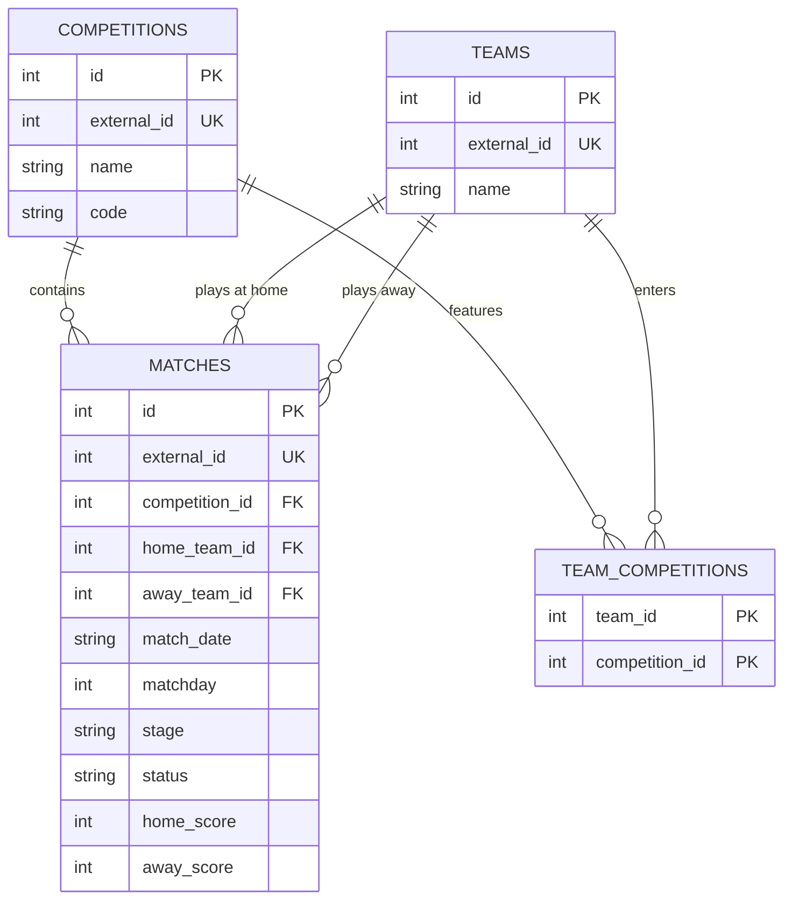
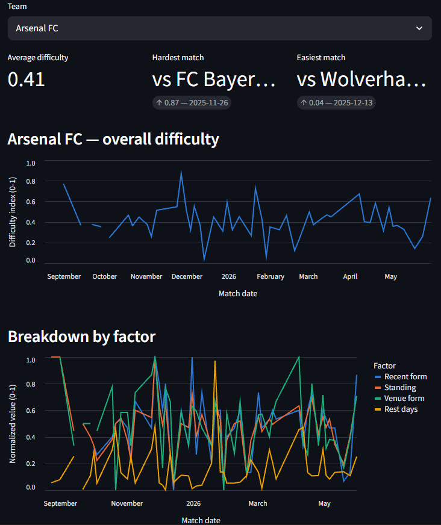
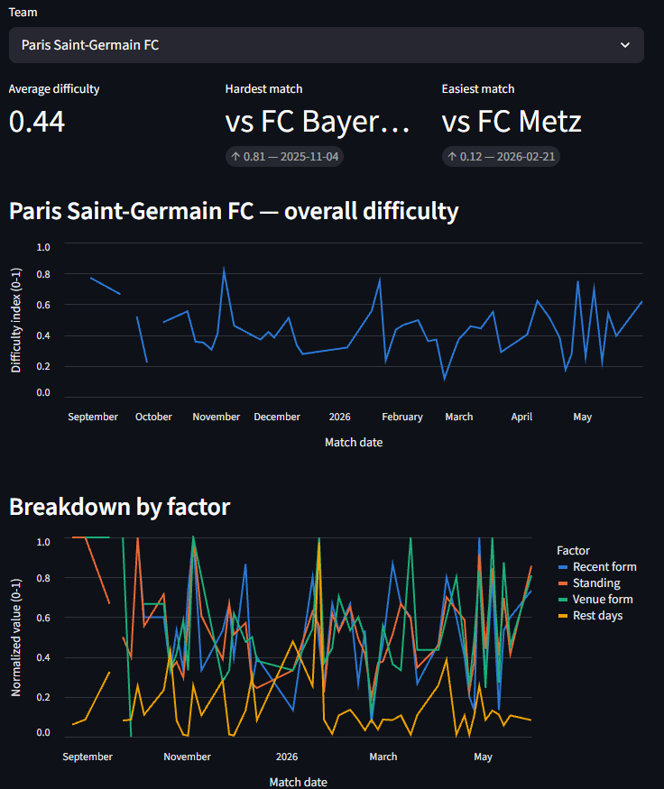
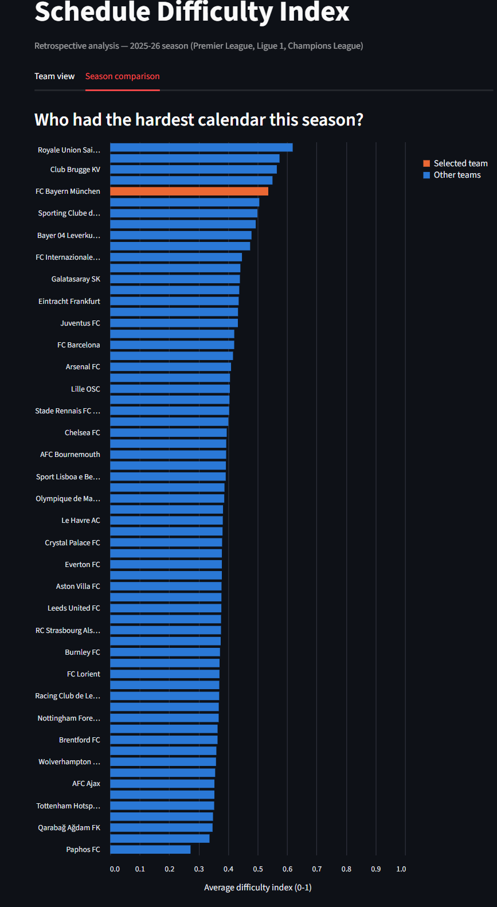

# Football Schedule Difficulty Index

A small ETL pipeline and dashboard that computes a composite **schedule
difficulty index** for football teams, using the Premier League, Ligue 1,
and the Champions League (2025-26 season).

## Problem

A final league table measures performance, not the difficulty of the run of
fixtures a team had to get through. Two teams finishing with the same points
total may have faced very different levels of opposition along the way.

This project asks: **was a team's calendar objectively harder than another's
this season — and if so, along which dimension?**

Each match is scored from the *opponent's* side, along 4 factors:

1. **Recent form** — the opponent's average points over their last 5 matches
2. **Standing** — the opponent's points per game so far this season
3. **Venue strength** — the opponent's average performance at the specific
   venue (home/away) this match is played at
4. **Physical freshness** — the opponent's days of rest since their previous
   match, across **all** competitions — the reason Champions League fixtures
   are in scope at all: a club juggling league and continental football can
   look fine in isolation and still be running on fumes

The four factors are normalized (min-max, 0-1) and averaged into a single
**schedule difficulty index** per match, per team.

## Data source

[football-data.org](https://www.football-data.org/) (free tier) — a clean,
documented REST API covering multiple competitions, no scraping required.

Scope: Premier League + Ligue 1 (the two domestic competitions), plus the
Champions League for the subset of teams playing continental football —
needed specifically for factor 4. The free tier restricts historical access
on some endpoints, but the immediately preceding completed season (2025-26)
is reachable via the `season` query parameter — chosen over the just-started
2026-27 season, which had too few matches played and no Champions League
fixtures yet at the time this project began.

## Architecture

- **Schema**: Kimball-style surrogate keys (`id`) plus a separate
  `external_id UNIQUE` per entity, decoupling the internal schema from the
  API's own identifiers. A `team_competitions` pivot table models the
  many-to-many relationship between teams and competitions, since a team can
  play in more than one at once.
- **Extract & Load**: `src/ingest.py` calls the API (retry with backoff,
  local JSON caching to avoid redundant calls) into `data/raw/`;
  `src/load.py` transforms and loads it into SQLite with idempotent upserts
  (`ON CONFLICT ... DO UPDATE`), wrapped in transactions.
- **Analytics layer**: a chain of SQL views forms a layered transformation
  DAG — staging (`team_match_results`) → per-factor intermediate views →
  mart (`team_schedule_difficulty`) — the same staging/intermediate/mart
  pattern tools like dbt formalize, built here by hand.
- **Testing**: a `pytest` suite, one file per view (`tests/views/`), checks
  durable invariants rather than one-off diagnostics — mainly by comparing
  two independent implementations of the same logic (a SQL window function
  against a plain Python recomputation).

### Entity-relationship diagram



## Dashboard

A Streamlit app with two views: a per-team breakdown (KPI tiles, difficulty
over time, and a factor-by-factor chart) and a season-wide ranking comparing
every team's average difficulty.





*(add your own screenshots under `docs/screenshots/` — see the note at the
bottom of this file)*

## Known limitations

- **Factor 2 is points-per-game, not a true rank.** A real ordinal rank
  would require comparing teams at the same point in time despite
  asynchronous schedules (games in hand) — a documented trade-off for this
  MVP, not an oversight.
- **No materialized views.** SQLite re-executes the full view chain from raw
  matches on every query. Invisible at ~875 matches; would need
  materialization (`CREATE TABLE AS SELECT`, or a real dbt project) at a
  larger scale.
- **Retrospective, not predictive.** This analyzes a completed season; it
  does not forecast upcoming fixtures.
- **Equal weighting is a starting assumption**, not a validated model — no
  attempt yet to test whether some factors matter more than others.

## Possible next steps

- Replace points-per-game with a true rank normalized for games played.
- Materialize the view chain (or migrate to dbt) if the dataset grows.
- Multi-season analysis, including a look at the COVID-era "closed doors"
  seasons — does the absence of a crowd change home advantage?
- Reload the dataset into BigQuery and compare query plans at "big data"
  scale.
- Weight the 4 factors by their actual correlation with match outcomes,
  instead of a flat average.

## Tech stack

Python, `requests`, SQLite, `pytest`, Streamlit, Altair.

## Running it locally

```bash
pip install -r requirements.txt
cp .env.example .env   # add your football-data.org API token
python src/ingest.py
python src/load.py
pytest
streamlit run dashboard.py
```
